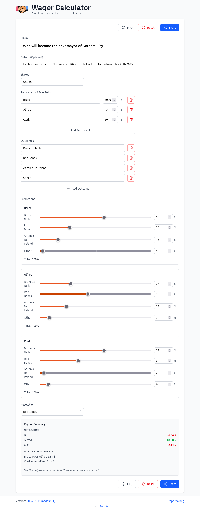

  

<h1 align="center">Wager Calculator</h1>

Calculate fair betting odds for friendly wagers using Brier scoring.

## Use It

**[w.ratfr.de](https://w.ratfr.de)** — works on any device, no installation needed. See the [FAQ](https://w.ratfr.de) in the app for detailed explanations.

Wagers can easily be shared via the URL. [Here](https://w.ratfr.de/#v=2&c=Who+will+become+the+next+mayor+of+Gotham+City%3F&d=Elections+will+be+held+in+November+of+2025.+This+bet+will+resolve+on+November+25th+2025.&s=usd&pn=Bruce%2CAlfred%2CClark&pb=3000%2C45%2C50&ol=Brunette+Nella%2CRob+Bones%2CAntonia+De+Ireland%2COther&pp=58%2C26%2C15%2C1%2C27%2C43%2C23%2C7%2C58%2C34%2C2%2C6&r=1) you can see the wager of the screenshot above.

## What It Does

- 2-8 participants, binary or multi-outcome bets (up to 8 outcomes)
- Fair payouts via Brier scoring (a proper scoring rule that rewards honest predictions)
- Multiple stake types: money (USD, EUR, etc.) or fun stakes (cookies, hugs)
- Share wagers via URL — all data stays in your browser, nothing stored on servers
- PWA: installable, works offline

## Progressive Web App (PWA)

This app is a PWA — it can be installed on your device and works offline. Once installed, it behaves like a native app with its own icon and window.

**To install:** Look for an install button in your browser's address bar or menu (often labeled "Install" or "Add to Home Screen") when you visit [w.ratfr.de](https://w.ratfr.de).

[Learn more about installing PWAs](https://developer.mozilla.org/en-US/docs/Web/Progressive_web_apps/Guides/Making_PWAs_installable)

## How Brier Scoring Works

Each participant's prediction accuracy is measured with a Brier score (lower = better). Payouts are based on how your score compares to others.

**Example:** Alice, Bob, and Carol bet $40 on whether it rains tomorrow. Tomorrow comes and it does rain.

- Alice: 70% rain → Brier score 0.18
- Bob: 30% rain → Brier score 0.98
- Carol: 50% rain → Brier score 0.50

Alice predicted best, Bob worst. Result: Alice wins $11.20, Carol wins $1.60, Bob pays $12.80.

The key property: reporting your true belief always maximizes your expected payout.

You can find detailed calculation examples in the [FAQ](https://w.ratfr.de) in the app.

---

## Development

See [docs/dev/DEVELOPMENT.md](docs/dev/DEVELOPMENT.md) for setup and deployment.

## Contributing

See [docs/dev/CONTRIBUTING.md](docs/dev/CONTRIBUTING.md).

## Security & Privacy

All calculations are client-side. No data collection. See [docs/dev/SECURITY.md](docs/dev/SECURITY.md).

## License

MIT — see [LICENSE](LICENSE).

## Attribution

Icon by [Freepik](https://www.freepik.com/icon/handshake_1006657).
